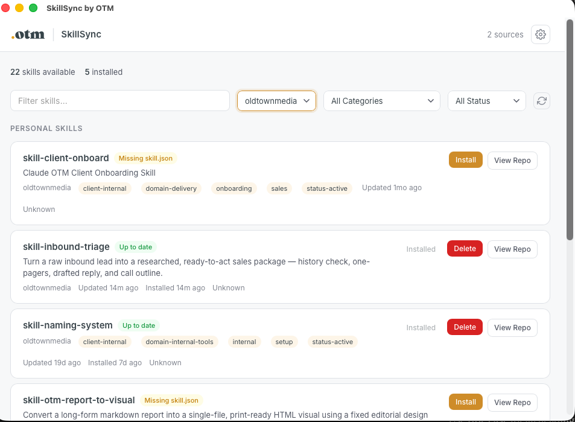
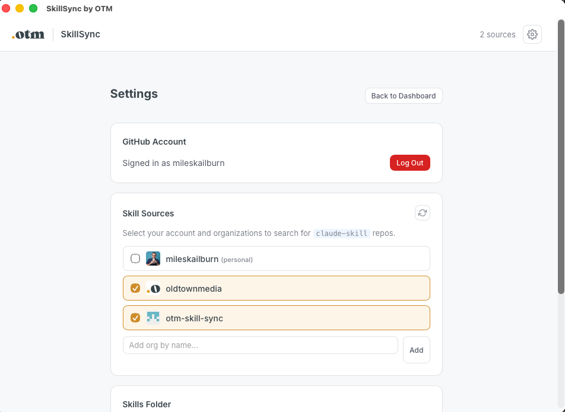
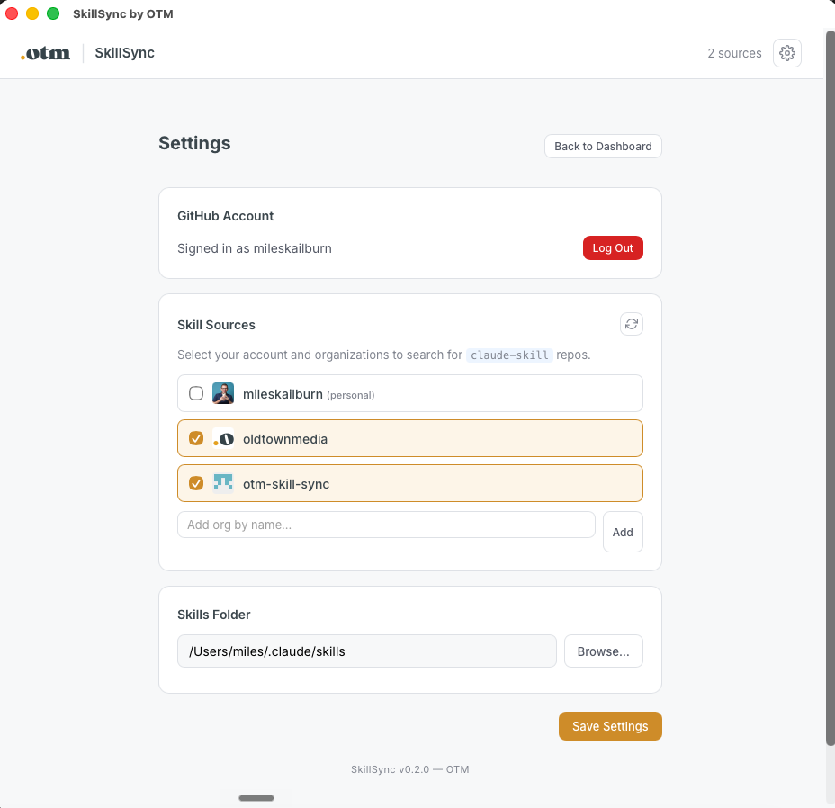

# OTM Claude Skill Guidelines

How OTM authors, names, and ships Claude **skills** — the small, reusable packets of instruction that teach Claude to run one of our repeatable workflows the same way every time (a discovery prep, a meeting recap, a UTM build).

This is the third sibling to our two UX standards: the [platform guide](../platform/OTM-BRAND-GUIDELINES.md) and the [WordPress plugin spec](../wordpress-plugins/OTM-WORDPRESS-PLUGIN-GUIDELINES.md). Those two govern how things **look**. This one governs how a skill is **structured, governed, and shipped** — quality, not pixels.

> **Who this is for.** Smart marketers and operators who are **not** engineers and who are building skills with an AI assistant (Claude in Cursor, Claude Code, or the desktop app). You do not need to write code. You need to write **clear instructions** and follow a few structural rules so the skill installs, triggers, and behaves predictably. Where a step is genuinely technical (creating a repo, pushing a version), hand it to your AI assistant and tell it "follow OTM-CLAUDE-SKILL-GUIDELINES.md."
>
> **What a skill is, in one line.** A folder Claude reads — a `SKILL.md` of instructions plus optional reference and template files — that turns "do the thing the OTM way" into a consistent, documented result instead of a freehand guess.

> **The two rules that carry the most weight.** (1) The **description is the product** — it is the only thing Claude reads to decide whether to use your skill, so it must say exactly when to fire and when not to. (2) **Don't override the host** — a skill asks for what it needs and reads from the source of truth; it never hardcodes client names, fabricates context, or assumes data it could request. (This is the same principle as the UX sets: pull from the source, don't invent.)

---

## 1. When to build a skill (vs a platform, plugin, or agent)

Reach for a skill when the work is a **repeatable workflow with a known shape** that you want run identically every time. Reach for something else when it isn't.

| Build a… | When the work is… | Lives in / shipped by | Example |
|---|---|---|---|
| **Skill** | A repeatable *workflow* or *ritual* — a sequence of steps, a document you produce, a check you run. Triggered in conversation. | A `claude-skill` repo, installed into `~/.claude/skills/` via SkillSync. | "Recap this meeting", "run discovery on [client]", "build a UTM" |
| **Platform / internal tool** | A standing *application* with its own screens, login, and data that people return to. | A deployed app (see [`platform/`](../platform/)). | The CaaS dashboard, the proposal builder UI |
| **WordPress plugin** | A feature that has to live *inside a client's WordPress site*. | A plugin (see [`wordpress-plugins/`](../wordpress-plugins/)). | A job board, a maintenance utility |
| **Agent** | An *autonomous operator* that runs many tools over a long task with little supervision. | An agent definition (out of scope here). | A background research operator |

**Quick test for "should this be a skill?"**

- ✅ You can describe it as "*when someone says X, produce Y by doing steps 1–N.*"
- ✅ You'd otherwise paste the same long prompt over and over.
- ✅ The output has a consistent format you can template.
- ❌ It needs a persistent UI, a database, or a login → that's a **platform**.
- ❌ It has to run on a client's website → that's a **plugin**.
- ❌ It's a one-off you'll never repeat → just prompt Claude directly; don't build anything.

When in doubt, prefer the smallest thing that works. A skill is lighter than a platform and far lighter than an agent.

---

## 2. Anatomy of a skill repo

Every OTM skill is **its own GitHub repo**, named with the skill's slug, and tagged with the `claude-skill` topic so SkillSync can find it (see §6–§7). The repo root must contain three files; everything else is optional supporting material.

```
skill-meeting-recap/                ← repo, named for the skill slug
├── SKILL.md                        ← REQUIRED. The instructions Claude reads.
├── skill.json                      ← REQUIRED. Machine-readable metadata for SkillSync.
├── README.md                       ← REQUIRED. Human documentation (what it is, how to use).
├── references/                     ← optional. Background docs the skill reads when it runs.
│   ├── format-rules.md
│   └── scoring-rubric.md
├── assets/                         ← optional. Templates the skill fills in (HTML, docx, md).
│   └── recap-template.md
└── examples/                       ← optional. Worked input → output samples.
    └── sample-recap.md
```

### The three required files

| File | Audience | Purpose |
|---|---|---|
| `SKILL.md` | **Claude** | The frontmatter (how it gets invoked) + the body (what to do). The heart of the skill. |
| `skill.json` | **SkillSync** (the installer) | Name, version, scope, requirements, tags. How the skill is distributed and updated. |
| `README.md` | **Humans** | Plain-English "what this does, when to use it, what it needs connected." |

### `SKILL.md` frontmatter

The top of `SKILL.md` is a small block fenced by `---` lines. Two fields matter:

```markdown
---
name: meeting-recap
description: >
  Transform a pasted transcript or rough notes into a structured recap with an
  executive summary, decisions, action items (owners + deadlines), and a ready-to-
  send follow-up email. Trigger on "summarize this meeting", "recap this call",
  "meeting notes", or when a user pastes a transcript and asks for structure.
---
```

- **`name`** — the skill slug. Lowercase letters, numbers, and hyphens only (`^[a-z0-9-]{1,64}$`). This becomes the folder name under `~/.claude/skills/`, so it must match the repo slug and the `skill.json` `name`.
- **`description`** — the single most important sentence(s) you will write. It is the *only* thing Claude sees when deciding whether to use the skill. It must (a) say what the skill produces and (b) list the **trigger phrases** that should invoke it. See §3 — this is its own contract.

### `skill.json`

The metadata SkillSync reads to install, version, and group the skill:

```json
{
  "name": "meeting-recap",
  "displayName": "Meeting Recap",
  "version": "1.0.0",
  "description": "Transform meeting transcripts or rough notes into structured recaps.",
  "author": "OTM",
  "scope": "org",
  "requires": { "mcp": [], "tools": [] },
  "tags": ["meetings", "productivity", "action-items"],
  "updatedAt": "2026-06-14"
}
```

- **`name`** — matches the `SKILL.md` name and the repo slug. Becomes the install folder.
- **`version`** — semver (`MAJOR.MINOR.PATCH`). Bumping this is how an update reaches everyone (§7).
- **`scope`** — `org` (everyone on the team should have it) or `personal` (optional / purpose-built).
- **`requires`** — what must be connected for the skill to work: `mcp` (connectors like HubSpot, ClickUp, Fathom) and `tools` (e.g. `code-execution`, web search). Leave empty if the skill is self-contained.
- **`displayName`, `tags`, `updatedAt`** — used by the SkillSync dashboard for browsing and search.

Your AI assistant can generate `skill.json` from the `SKILL.md` — but **you** own the `scope` and `requires` calls, because they decide who gets it and whether it works.

---

## 3. The description + trigger contract

This is the part most skills get wrong, so it gets its own section.

**Why it matters.** Claude does not read your whole `SKILL.md` to decide whether to use the skill. It reads the **description** (and the trigger phrases inside it) against what the user just said. A vague description means the skill fires when it shouldn't, or stays silent when it should. A sharp one means it fires exactly when intended. The description *is* the invocation logic.

### What a good description contains

1. **What it produces** — the concrete deliverable. ("a structured recap with decisions and action items.")
2. **When to use it** — the situations and **trigger phrases**, quoted the way a user would actually say them.
3. **What it does *not* do** — the boundary, so it doesn't poach work that belongs to another skill.

### Writing trigger phrases

- Quote real user language, not internal jargon: `"recap this call"`, not `"invoke recap subroutine"`.
- List several phrasings — people ask the same thing many ways.
- Include the pasted-content case if relevant: "…or when a user pastes a transcript and asks for structure."
- Cover both the full-name request and the casual one: `"run discovery on [client]"` and `"prep me for [client]"`.

### Stating what it does and doesn't do (and handing off)

Skills work in **chains**. A description should name where its job ends and the next skill begins, so two skills don't fight over the same request. Real example from our sales funnel:

> **`skill-inbound-triage`** handles a fresh lead with no call booked — research, two one-pagers, a follow-up draft, a second-call outline. Its description ends with the boundary: *"This is the FRONT of the funnel and hands off to `skill-otm-sales-discovery` once a call is booked. It does not produce a pre-call brief, discovery diagnosis, deck, or proposal."*
>
> **`skill-otm-sales-discovery`** picks up there — *"produces conversation-shaping artifacts that come BEFORE the proposal builder. It does not produce final pricing… that is the proposal builder's job."*

Each one says **what it owns** and **what it explicitly doesn't**, naming the sibling that takes over. That handoff line is what keeps the chain clean. Write yours the same way: end the description with "Hands off to `[next-skill]` for [X]. Does not do [Y]."

---

## 4. Writing the skill body

Below the frontmatter, the body is the actual instructions. Write it as if onboarding a sharp new teammate who will do this task for the first time.

### Altitude — write the rule, not the keystrokes

Aim for the **middle altitude**: specific enough to be repeatable, general enough to handle the variation real inputs bring.

- ❌ Too low: "Click the blue button, then type the name in box two." (brittle, breaks instantly)
- ❌ Too high: "Make a good recap." (no consistency — the whole point of a skill is lost)
- ✅ Right: "Extract action items as *owner → task → deadline*. If an owner is unclear, ask rather than guess."

### Step structure

Open with **why the skill exists** (one short paragraph — it helps Claude make judgment calls), then a **When to use** list that mirrors the trigger phrases, then numbered **Steps**. A common, reliable shape:

```markdown
## When to use
- "recap this call", "summarize this meeting", pasted transcript + "structure this"

## Required inputs
Before doing any work, confirm: 1) the transcript or notes, 2) meeting type.
If a critical input is missing, ASK before proceeding — never fabricate it.

## Instructions
### Step 1: Identify the input type
### Step 2: Extract metadata (title, date, attendees)
### Step 3: Produce the recap using the format below
### Step 4: Offer the follow-up email draft
```

If the skill has distinct modes (e.g. "full project" vs "jump to one phase"), put them in a small **modes table** near the top, like `otm-naming-system` does.

### Tool use

If the skill relies on connected tools, state it plainly and handle the missing case:

- Name the MCPs/tools it expects (and mirror them in `skill.json` `requires`).
- Say what to do if one isn't connected: "If HubSpot is not connected, flag it and offer to proceed with web research only."
- **Never silently retry or fabricate.** If a connector errors, suggest reconnecting. If client context is missing, ask for it or proceed transparently with less.

### Asking vs assuming

The defining habit of a good OTM skill: **it asks when it doesn't know, and never invents.**

- Missing client name, ambiguous mode, unclear owner → **ask** (one brief question), then proceed.
- Never fabricate client context, numbers, or quotes. "Never fabricate" should appear in any skill that touches client data.
- But don't over-ask: if a sensible default exists, state it and move on. Ask only when the answer changes the output.

---

## 5. Reference and asset organization

Keep `SKILL.md` lean. Anything long, reusable, or template-shaped moves into a folder so the instructions stay readable.

| Folder | Holds | The skill… |
|---|---|---|
| `references/` | Background knowledge: rubrics, format rules, checklists, framework explanations. | **reads** these while running, to stay consistent. |
| `assets/` | Fill-in templates: an HTML one-pager, a recap markdown skeleton, a deck shell. | **populates** these to produce deliverables. |
| `examples/` | Worked input → output samples. | learns the **target quality** from these; humans use them to understand the skill. |
| `outputs/` | Where generated deliverables get written (named `outputs/<client-slug>-thing.md`). | **writes** results here at run time. |

Rules of thumb:

- In `SKILL.md`, **point** to a reference ("Score using the rubric in `references/scoring-rubric.md`") instead of pasting the whole rubric inline.
- Templates are data, not instructions — keep them in `assets/`, and have the body say which template to fill and where to save the result.
- One concept per reference file, named for what it holds. Future-you will thank present-you.

---

## 6. Naming and topics

**Skill slug (the `name`).** Lowercase, hyphenated, descriptive, `^[a-z0-9-]{1,64}$`. The slug is used in three places and must match in all of them: the **repo name**, the `SKILL.md` `name`, and the `skill.json` `name`. It also becomes the install folder `~/.claude/skills/<slug>/`.

- Name for the **job**, verb-or-noun-first, readable at a glance: `meeting-recap`, `utm-builder`, `inbound-triage`, `competitor-monitor`.
- OTM-process skills that shape a specific OTM methodology may carry the `otm-` or `skill-` convention used by the family (e.g. `otm-naming-system`, `skill-otm-sales-discovery`). Match the siblings already in the family rather than inventing a new prefix.
- Avoid versions or dates in the name (`recap-v2` ❌ — versioning lives in `skill.json`).

**The `claude-skill` topic — the distribution marker.** A skill repo only becomes installable once it is tagged with the GitHub topic **`claude-skill`**. SkillSync discovers skills by scanning the source org for that topic. No topic → invisible to the installer. Your assistant can set it: `gh repo edit <org>/<slug> --add-topic claude-skill`.

**Scope.** Set `skill.json` `scope` deliberately: `org` for things everyone should have, `personal` for narrow or experimental skills. Scope drives how the dashboard groups it and whether it's part of "pull everything."

> For OTM brand/product *naming* questions (naming a client's product, not naming a repo), that's the separate [`skill-naming-system`](https://github.com/oldtownmedia) methodology — different concern. This section is about **technical skill-repo naming**.

---

## 7. Versioning and distribution via SkillSync

Skills are distributed by **SkillSync** — OTM's Mac app for browsing, installing, and updating skills (the same engine is also available as the `otm-skills` CLI). SkillSync scans the GitHub orgs you select for repos tagged `claude-skill`, shows you what's available versus installed, and writes skills into your local `~/.claude/skills/` folder. No manual file moving, no git commands — a teammate clicks **Install** and the skill appears in Claude.

### The SkillSync app

SkillSync is the cloud-to-desktop bridge: skills live in GitHub (the cloud source of truth), and the app pulls the current version down to each person's Mac and keeps it in sync.

**The dashboard** — browse and manage skills. Each skill card shows its name, description, tags, when it was last updated, and a **status** with the right action:



| Status badge | Meaning | Action offered |
|---|---|---|
| **Up to date** | Installed, matches the latest version in the repo. | **Delete** (remove it locally) |
| *(behind)* | Installed, but the repo has a newer version. | **Update** to pull the new version |
| **Missing skill.json** | The repo is tagged `claude-skill` but has no valid `skill.json`, so it can't be versioned or managed. | **Install** still offered, but fix the metadata (§2) so it tracks properly |
| *(not installed)* | Available in a source but not on this Mac. | **Install** |

The header shows totals ("22 skills available · 5 installed"), and you can filter by text, **source org**, **category**, and **status**. **View Repo** jumps to the skill's GitHub repo. This is why the rules in §2 and §6 matter in practice: a skill with a mismatched slug or missing `skill.json` shows up here as broken ("Missing skill.json") instead of cleanly installable.

**Settings — sources and folder.** Each person points SkillSync at the GitHub account and orgs to search, and at the local skills folder:



- **GitHub Account** — sign in once (the app authenticates to read your `claude-skill` repos).
- **Skill Sources** — check the orgs to scan (e.g. `oldtownmedia`, `otm-skill-sync`). Only repos tagged `claude-skill` in those sources appear. This is the org-level analog of the distribution marker from §6.
- **Skills Folder** — where skills install, normally `~/.claude/skills`. The footer shows the app version (e.g. `SkillSync v0.2.0 — OTM`).



**The CLI is the same tool.** Everything above is also scriptable for people who prefer the terminal:

```bash
otm-skills status            # what's available vs installed
otm-skills pull              # update everything that's behind
otm-skills pull <slug>       # install/update one skill
otm-skills list              # list installed skills
otm-skills rollback <slug>   # restore the most recent backup
```

### How a skill reaches people

```
Author edits SKILL.md / bumps skill.json version → push to the skill's claude-skill repo (the cloud source)
        │
        ▼
SkillSync (app or otm-skills CLI) sees the new version on the repo
        │
        ▼
Teammate clicks Update / runs `otm-skills pull`  →  validated  →  backed up  →  written to ~/.claude/skills/<slug>/
```

### The version bump is the release

There is no separate "publish" step — **bumping `skill.json` `version` (semver) and pushing is the release.** Teammates pick it up with `otm-skills pull` (updates everything behind) or `otm-skills pull <slug>` (one skill).

- **PATCH** (`1.0.0 → 1.0.1`) — wording fixes, typo, tightened step. No behavior change.
- **MINOR** (`1.0.1 → 1.1.0`) — new capability, new trigger, new template. Backward-compatible.
- **MAJOR** (`1.1.0 → 2.0.0`) — the skill now behaves differently enough that someone relying on the old output should take note (changed deliverable format, removed a mode).

Also bump `updatedAt`. Keep `version` and `updatedAt` in step with what actually changed.

### Changelog convention

Keep a short `CHANGELOG.md` in the skill repo, newest first, so teammates know what a pull will change:

```markdown
# Changelog

## 1.1.0 — 2026-06-14
- Add "client call" mode and a follow-up email template (assets/follow-up.md)

## 1.0.1 — 2026-06-02
- Tighten action-item extraction; ask for owner instead of guessing

## 1.0.0 — 2026-05-20
- Initial release
```

### What SkillSync does for safety (so you don't have to worry)

- **Validates** every skill before writing (SKILL.md present, valid `skill.json`, name regex, valid semver, no path traversal).
- **Backs up** the existing folder before overwriting (keeps the last 5) and supports `otm-skills rollback <slug>`.
- **Warns on collisions** if a folder exists that it didn't install.

You don't run any of this by hand — but knowing it exists is why the rules above (matching names, valid semver, the topic) matter: break one and SkillSync refuses or skips the skill.

---

## 8. Testing a skill before distribution

Never tag `claude-skill` on something you haven't watched run. Test locally first.

1. **Install it locally for yourself.** Put the skill folder in your own `~/.claude/skills/<slug>/` (or `otm-skills pull <slug>` from a personal branch/repo). Restart your Claude client so it loads.
2. **Trigger test — does it fire on the right words, and stay quiet on the wrong ones?** Say each trigger phrase from the description; confirm the skill activates. Then say something adjacent that should *not* trigger it (and that belongs to a sibling skill) and confirm it stays out of the way. This is the description contract from §3, verified.
3. **Happy-path run.** Give it a realistic input and confirm the output matches the format and quality you intended.
4. **Missing-input run.** Give it an *incomplete* input and confirm it **asks** instead of fabricating. This is the asking-vs-assuming rule from §4 — the most common failure mode.
5. **No-connector run** (if it uses MCPs). Disconnect a required tool and confirm it degrades gracefully (flags the gap, offers a fallback) rather than hallucinating data.
6. **Boundary check.** Confirm it hands off / declines work that belongs to another skill, per its own description.

Only when all six behave do you set `scope`, tag `claude-skill`, and let SkillSync distribute it.

---

## 9. Do's and don'ts

### Do

- Write the **description first** and make it earn its triggers — it's the product.
- State **what the skill does NOT do** and name the skill it hands off to.
- **Ask** for missing inputs; default sensibly when a default is obvious.
- Keep `SKILL.md` lean; push rubrics to `references/` and templates to `assets/`.
- Match the slug across repo / `SKILL.md` / `skill.json`, and tag `claude-skill`.
- Bump `version` (semver) + `updatedAt` and add a changelog line on every change.
- Test all six cases in §8 before distributing.
- Mirror required connectors in `skill.json` `requires` and handle them being missing.

### Don't

- Don't write a vague description ("helps with meetings") — it mis-fires.
- Don't **fabricate** client context, numbers, or quotes. Ever.
- Don't silently retry a failed connector or assume an answer you could ask for.
- Don't put versions or dates in the slug — versioning lives in `skill.json`.
- Don't paste long rubrics/templates inline — reference them.
- Don't let two skills claim the same trigger — draw the boundary in the description.
- Don't ship a skill you haven't watched run, or tag `claude-skill` before it passes §8.
- Don't build a skill for a one-off — just prompt Claude directly.

---

## 10. Starter template and a worked example

### Copy-paste starter `SKILL.md`

A ready-to-fill starter also lives at [`templates/SKILL.md`](templates/SKILL.md). Replace every `[bracket]`.

```markdown
---
name: [skill-slug]
description: >
  [What it produces, in one concrete line.] Trigger on "[phrase one]",
  "[phrase two]", "[phrase three]", or when [the pasted-content / situational
  case]. Hands off to [next-skill] for [X]. Does not [the boundary].
---

# [Skill Name]

[One-line plain-English summary of the deliverable.]

**Why this skill exists.** [One short paragraph: the consistency or quality
problem it solves, so Claude can make good judgment calls.]

## When to use
- "[phrase one]", "[phrase two]"
- When [situational trigger]

## Required inputs
Before doing any work, confirm:
1. [Input A — e.g. the client name]
2. [Input B]
If a critical input is missing, ASK once, then proceed. Never fabricate it.

## Instructions
### Step 1: [Identify / gather]
### Step 2: [Do the core transformation]
### Step 3: [Produce the deliverable using assets/<template>]
### Step 4: [Offer the next action / hand off]

## Output format
[Show the exact shape of the deliverable, or point to assets/<template>.]
```

And the companion `skill.json`:

```json
{
  "name": "[skill-slug]",
  "displayName": "[Skill Name]",
  "version": "1.0.0",
  "description": "[Same concrete line as the description.]",
  "author": "OTM",
  "scope": "personal",
  "requires": { "mcp": [], "tools": [] },
  "tags": ["[topic]", "[topic]"],
  "updatedAt": "[YYYY-MM-DD]"
}
```

### Minimal worked example

A complete, tiny skill is included at [`examples/skill-utm-namer/`](examples/skill-utm-namer/) — a `utm-namer` that turns a campaign description into a consistent UTM-tagged URL. It shows the three required files, a `references/` doc, the description+trigger contract, the ask-don't-assume rule, and a boundary line. Read it end to end as a model; it is intentionally small enough to absorb in two minutes.

---

> **Make it presentable.** Like our other standards, this guideline should be regenerated into a single-page visual with the **report-to-visual** skill (`otm-report-to-visual`) whenever it's published or substantially updated, so the team can read it as a polished one-pager rather than raw markdown.

---

Part of the [OTM Build Standards](../README.md) collection. This is the **Claude Skills** set (structure, governance, distribution).
